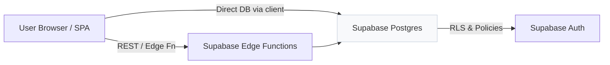
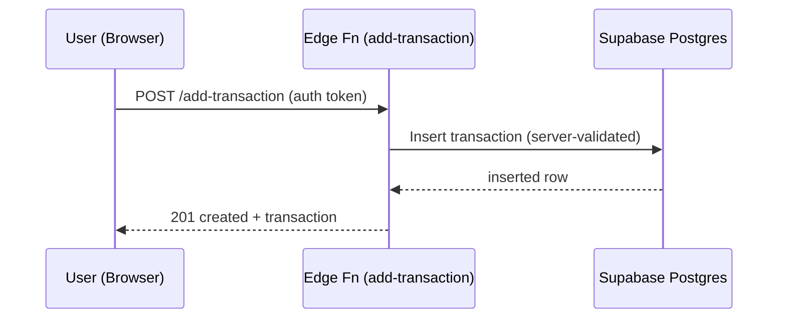
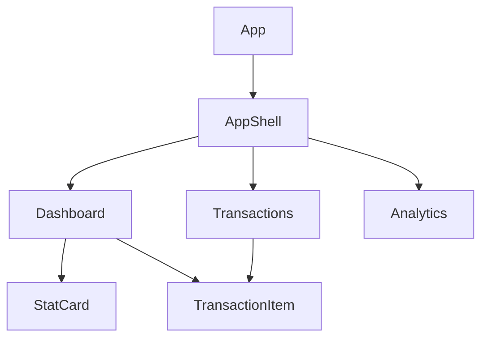

# FinTrack — Personal Finance, Simplified

FinTrack is a focused personal finance tracker built with React, Vite, and Supabase. This README describes the system architecture, data model, security (RLS), Edge Function usage, deployment steps, and admin workflows. Credit: project steward `kelvincodes25` (you).

---

**Contents**
- Overview
- Architecture (visual diagrams)
- Data model & RLS
- Edge functions & backend
- Frontend structure
- Admin panel & how to grant admin access
- Deploy / local run
- Credits

---

## Overview

FinTrack provides a minimal, private-first way to log income and expenses, view trends, and inspect category breakdowns. It's intentionally simple and designed to be extended.

Key features
- Per-user transactions with strong Row-Level Security (RLS)
- Pre-seeded categories with colors and icon keys
- Charts for trends and category breakdowns
- Server-side helpers in Supabase Edge Functions for safe inserts/aggregations
- Small, maintainable React codebase with CSS Modules

---

## Architecture (visual)

Component diagram (high-level):



Sequence for adding a transaction:



---

## Data model & security

- `public.profiles` — stores `user_id`, `email`, `full_name`, `is_admin` and created/updated timestamps. A small trigger keeps it in sync with `auth.users`.
- `public.categories` — seeded default categories (icon keys) plus user-created categories.
- `public.transactions` — core table with `amount`, `type` ('expense'|'income'), `category_id`, `transaction_date` and `note`.

RLS (Row-Level Security) overview:
- Transactions and budgets are protected so each authenticated user can only access their own rows.
- `profiles` has RLS that permits reading/updating own profile and allows admin users to read/update all profiles via a `public.is_admin_user()` helper function.

Files:
- SQL schema & migrations: `supabase/migrations/`
- RLS helper function and trigger are defined in the migrations (see `0001_initial_schema.sql` and `0002_admin_profiles.sql`).

---

## Edge Functions

Edge functions are implemented in `supabase/functions/` (Deno + Supabase JS). They centralize server-side checks and aggregations:
- `add-transaction` — verifies payload, sets absolute amount, inserts `transactions`, returns created row with category join.
- `delete-transaction` — deletes a transaction if caller is owner.
- `get-analytics` — aggregates monthly totals, category breakdown, daily spending, and 6-month history for charts.

Deploy functions with the Supabase CLI (example):

```bash
supabase login
supabase link --project-ref <YOUR_PROJECT_REF>
supabase functions deploy add-transaction
supabase functions deploy get-analytics
supabase functions deploy delete-transaction
```

---

## Frontend structure (visual)



Key frontend files:
- `src/components/` — reusable UI components (`AppShell.jsx`, `TransactionItem.jsx`, `AddTransactionModal.jsx`, `StatCard.jsx`, `AppIcon.jsx`)
- `src/pages/` — route pages (`Dashboard.jsx`, `Transactions.jsx`, `Analytics.jsx`, `Landing.jsx`, `Admin.jsx`)
- `src/hooks/` — data hooks and Supabase helpers (`useAuth.jsx`, `useTransactions.js`, `useAnalytics.js`, `useCategories.js`)
- `src/lib/supabase.js` — Supabase client & `callEdgeFunction` helper
- `src/lib/formatCurrency.js` — centralized KSh formatter

---

## Admin panel & granting admin access

An Admin panel was added at `src/pages/Admin.jsx` for monitoring users and transactions. Access is gated to users whose `profiles.is_admin = true`.

To grant admin rights to a user by email (run in Supabase SQL editor or psql), example:

```sql
-- If the auth user already exists, this will upsert their profile and enable admin
INSERT INTO public.profiles (user_id, email, full_name, is_admin, created_at, updated_at)
SELECT id, email, NULL, true, now(), now()
FROM auth.users
WHERE lower(email) = lower('kelvincodes25@gmail.com')
ON CONFLICT (user_id) DO UPDATE SET is_admin = true, updated_at = now();

-- Alternatively: (if profiles row already exists)
UPDATE public.profiles
SET is_admin = true, updated_at = now()
WHERE lower(email) = lower('kelvincodes25@gmail.com');
```

You can also apply the migration `supabase/migrations/0003_make_kelvin_admin.sql` which is idempotent and will set `is_admin = true` for the provided email when run via `supabase db push`.

---

## Run & deploy (quick)

Prereqs: Node 18+, npm, Supabase CLI (optional for functions & migrations)

Local development

```bash
npm install
# set environment variables in .env (VITE_SUPABASE_URL, VITE_SUPABASE_ANON_KEY)
npm run dev
```

Build for production

```bash
npm run build
```

Apply database migrations (local → Supabase project)

```bash
supabase db push
```

Deploy to Vercel: connect repo or use `vercel` CLI; ensure `VITE_SUPABASE_URL` and `VITE_SUPABASE_ANON_KEY` are set as environment variables in Vercel.

---

## Operational notes & best practices

- Keep `profiles.is_admin` usage minimal: prefer one or two admin accounts.
- Use Supabase project policies and review the `public.is_admin_user()` helper to ensure no unsafe privilege escalation.
- For production, rotate service keys and keep secrets out of the repository.
- Consider adding audit logging (e.g., admin actions) to a `admin_audit` table if you expand admin capabilities.

---

## File references

- Schema/migrations: `supabase/migrations/`
- Edge functions: `supabase/functions/`
- Admin UI: `src/pages/Admin.jsx`
- Icon helper: `src/components/AppIcon.jsx`

---

## Credits

- Project steward & contributor: `kelvincodes25` (you) — credit is included here per your request.
- Development & AI assistant contributions: code changes and README authored in the repo.

If you'd like a rendered architecture diagram (SVG/PNG) or a short intro video, I can generate assets and add them to `public/` or create a `/docs` folder. Do you want that next?
# FinTrack

A clean, professional personal finance tracker built with React + Supabase + Vite. Deploy to Vercel in minutes.

---

## Features

- **Landing page** with sign-up / sign-in
- **Dashboard** — monthly snapshot, recent transactions
- **Transactions** — full list with search, filter by type & category
- **Analytics** — charts: 6-month bar, category pie, savings trend, category breakdown bars
- **Edge Functions** — add, delete, analytics via Supabase
- **RLS** — every user sees only their own data
- **Fully responsive** — desktop sidebar + mobile bottom nav + slide-up modal

---

## Stack

| Layer | Tech |
|---|---|
| Frontend | React 18, Vite, CSS Modules |
| Auth | Supabase Auth |
| Database | Supabase Postgres |
| API | Supabase Edge Functions (Deno) |
| Charts | Recharts |
| Hosting | Vercel |

---

## Quick Start

### 1. Clone & install

```bash
npm install
```

### 2. Create a Supabase project

Go to [supabase.com](https://supabase.com) → New project.

### 3. Run the migration

In the Supabase SQL editor, paste and run the contents of:

```
supabase/migrations/0001_initial_schema.sql
```

This creates all tables, RLS policies, indexes, and seeds 13 default categories.

### 4. Configure environment

```bash
cp .env.example .env
```

Fill in your values from the Supabase project settings:

```
VITE_SUPABASE_URL=https://xxxx.supabase.co
VITE_SUPABASE_ANON_KEY=eyJ...
```

### 5. Deploy Edge Functions

```bash
# Install Supabase CLI if needed
npm install -g supabase

supabase login
supabase link --project-ref YOUR_PROJECT_REF

supabase functions deploy add-transaction
supabase functions deploy get-analytics
supabase functions deploy delete-transaction
```

### 6. Run locally

```bash
npm run dev
```

### 7. Deploy to Vercel

```bash
# Option A: Vercel CLI
npm install -g vercel
vercel

# Option B: Connect your GitHub repo at vercel.com
# Add VITE_SUPABASE_URL and VITE_SUPABASE_ANON_KEY as environment variables
```

---

## Database Schema

### `categories`
| Column | Type | Notes |
|---|---|---|
| id | uuid PK | |
| user_id | uuid FK | null = default/global |
| name | text | |
| icon | text | emoji |
| color | text | hex |
| is_default | boolean | |
| created_at | timestamptz | |

### `transactions`
| Column | Type | Notes |
|---|---|---|
| id | uuid PK | |
| user_id | uuid FK | auth.users |
| category_id | uuid FK | categories |
| name | text | description |
| amount | numeric(12,2) | always positive |
| type | text | 'expense' or 'income' |
| note | text | optional |
| transaction_date | date | |
| created_at | timestamptz | |
| updated_at | timestamptz | auto-updated |

### `budgets`
| Column | Type | Notes |
|---|---|---|
| id | uuid PK | |
| user_id | uuid FK | |
| category_id | uuid FK | |
| monthly_limit | numeric(12,2) | |
| month | integer | 1–12 |
| year | integer | |

---

## Edge Functions

| Function | Method | Description |
|---|---|---|
| `add-transaction` | POST | Validate & insert a transaction |
| `get-analytics` | GET | Monthly summary, category breakdown, 6-month history |
| `delete-transaction` | DELETE | Delete by ID (owner-only) |

---

## Project Structure

```
fintrack/
├── public/
│   └── favicon.svg
├── src/
│   ├── components/
│   │   ├── AppShell.jsx          # Sidebar + mobile nav wrapper
│   │   ├── AddTransactionModal.jsx
│   │   ├── TransactionItem.jsx
│   │   └── StatCard.jsx
│   ├── hooks/
│   │   ├── useAuth.jsx           # Auth context + helpers
│   │   ├── useTransactions.js
│   │   ├── useAnalytics.js
│   │   └── useCategories.js
│   ├── lib/
│   │   └── supabase.js           # Supabase client + edge fn helper
│   ├── pages/
│   │   ├── Landing.jsx
│   │   ├── Auth.jsx
│   │   ├── Dashboard.jsx
│   │   ├── Analytics.jsx
│   │   └── Transactions.jsx
│   ├── App.jsx
│   ├── main.jsx
│   └── index.css                 # Global CSS variables + animations
├── supabase/
│   ├── config.toml
│   ├── migrations/
│   │   └── 0001_initial_schema.sql
│   └── functions/
│       ├── add-transaction/index.ts
│       ├── get-analytics/index.ts
│       └── delete-transaction/index.ts
├── .env.example
├── vercel.json
├── vite.config.js
└── package.json
```
